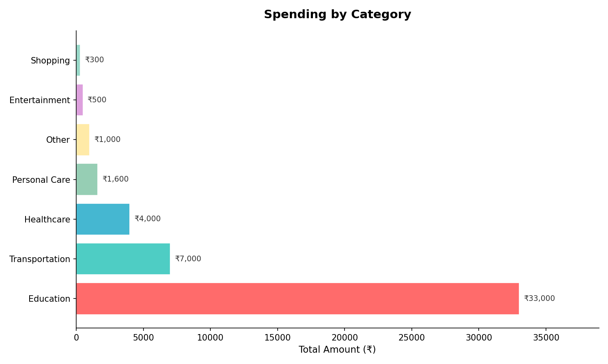
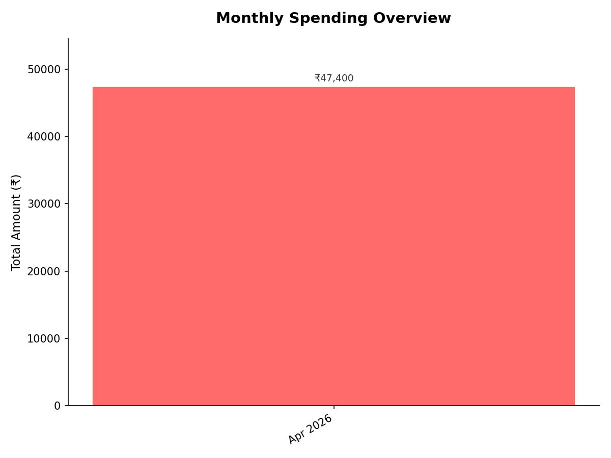
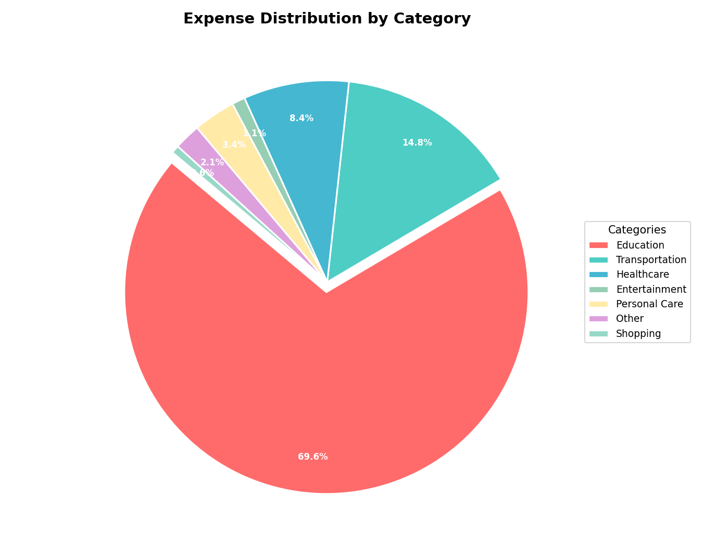

# Smart Expense Tracker

A simple Python CLI app to track daily expenses, analyze spending by category, and generate monthly reports with Matplotlib charts.

## Features
- Add and view expenses
- Category-wise analysis
- Monthly reports
- CSV data storage
- Charts using Matplotlib

## Screenshots

### Category Chart

### Monthly Chart

### Pie Chart

## Tech Stack
- Python
- CSV
- Matplotlib

## How to Run
pip install matplotlib  
python Expense_tracker.py

## Project Structure
- Expense_tracker.py
- expenses.csv
- chart_images

## Author
Shubhransu Sekhar
